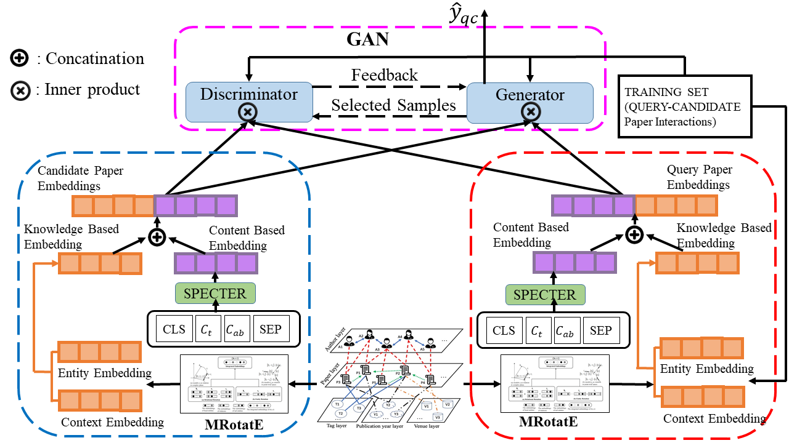

# KGE-GAN

This is the official implementation for our paper [Improved paper recommendation model incorporating  knowledge graph embedding with IRGAN model](https://TO BE INSERTED) by [Nimbeshaho Thierry](https://scholar.google.com/citations?user=eJ2WT9UAAAAJ&hl=en), [Ingabire Batamira Christ Chatelain](https://scholar.google.com/citations?hl=en&user=taiWWHMAAAAJ), [Zafar Ali](https://scholar.google.com/citations?user=cgBnRTcAAAAJ&hl=en), [Pavlos Kefalas](https://scholar.google.com/citations?hl=en&user=QaBjHzQAAAAJ&view_op=list_works&sortby=pubdate).

\


\
        **Figure 1: Model Architecture**
          \
          \
          \
#**1.MRotatE Embedding**

#
Knowledge Graph Embedding by Relational and Entity Rotation

**Implemented features**\
Loss Function:

 - [x] Uniform Negative Sampling
 - [x] Self-Adversarial Negative Sampling

**Usage**

Knowledge Graph Data:
 - *entities.json*: a dictionary map entities to unique ids
 - *relations.json*: a dictionary map relations to unique ids
 - *train.txt*: the KGE model is trained to fit this dataset
 - *valid.txt*: create a blank file if no validation data is available
 - *test.txt*: the KGE model is evaluated on this data set

**Train**

For example, this command train a MRotatE model on DBLP/ACM dataset with GPU 0.
```
CUDA_VISIBLE_DEVICES=0 python -u codes/run.py --do_train \
 --cuda \
 --do_valid \
 --do_test \
 --data_path data/train.txt \
 --model MRotatE \
 -n 256 -b 512 -d 1000 \
 -g 24.0 -a 1.0 -adv \
 -lr 0.0001 --max_steps 50000 \
 -save models/RotatE_DBLP_0 --test_batch_size 8 -te
```
   Check argparse configuration at codes/run.py for more arguments and more details.

**Test**

    CUDA_VISIBLE_DEVICES=$GPU_DEVICE python -u $CODE_PATH/run.py --do_test --cuda -init $SAVE

**Reproducing the best results**


The run.sh script provides an easy way to search hyper-parameters:

    bash run.sh train MRotatE train.txt 0 0 512 256 1000 24.0 1.0 0.0001 50000 8 -te


**Using the library**

The python libarary is organized around 3 objects:

 - TrainDataset (dataloader.py): prepare data stream for training
 - TestDataSet (dataloader.py): prepare data stream for evluation
 - KGEModel (model.py): calculate triple score and provide train/test API

The run.py file contains the main function, which parses arguments, reads data, initilize the model and provides the training loop.


#**2.SPECTER  Embedding**
#
- Use the pretrained model available at : https://github.com/allenai/specter    \
 Requirement: pip install --upgrade transformers==4.2\
- Learn paper embeddings: Data can be downloaded at: https://dblp.uni-trier.de/  and https://www.aminer.cn/citation \
- Save  the data in SPECTER/data
-  For more details how to use  the pretrained model find readme file in SPECTER/Codes 
 
#**3. IRGAN Model**
- The Paper embeddings learned by  prior models are combined into " paper_embeddings_test/train.txt" and  input to GAN  to learn optimal representations
- We have employed  the generator G’s score function to calculate the final score as depicted by the main figure  in our paper.  However the discriminator  D's score has similar efficiency
- For more details about paper  recommendations, find readme in IRGAN/

**Vizualizations**
- *LearningRate.ipynb*: creates the step size at each iteration while moving toward a minimum of the loss function.
- *epoch.ipynb*: creates plots to depict epochs with respect to nDCG to show peak performance.
- *recall.ipynb*: generates plots to exhibit the stability and robustness of the proposed model's results.
- *FineTune_beta.ipynb*:  generates a  plot  to depicts how we fine-tuned the equilibrium parameter beta during model training.


**Evaluation Metrics**

 - [x] MRR, MAP, nDCG, Recall


